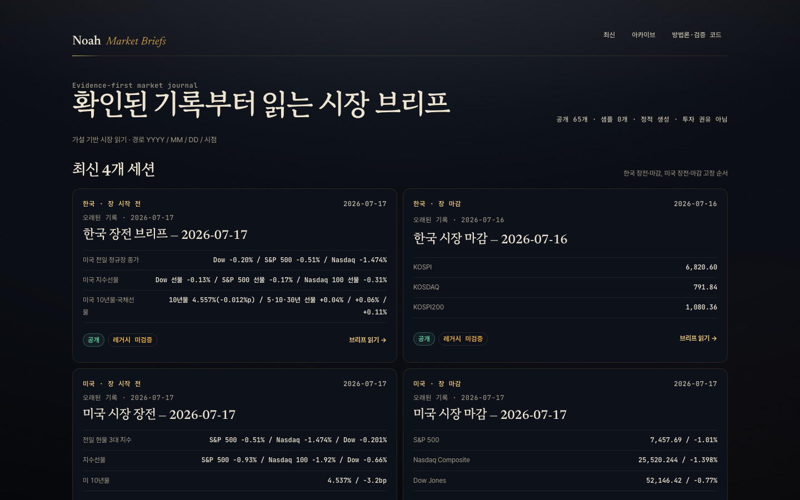
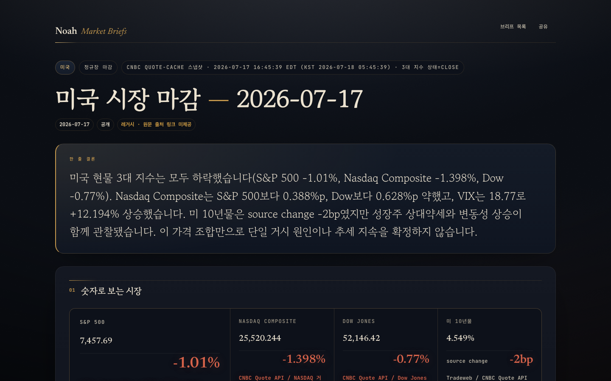

<p align="center">
  
</p>

<p align="center"><em>숫자에는 반드시 출처와 시각을.</em></p>

<p align="center">
  <a href="https://github.com/Noah-TaeHwan/noah-market-briefs/actions/workflows/ci.yml"></a>
  <a href="https://noah-market-briefs.vercel.app/market-briefs"></a>
  <a href="LICENSE"></a>
  
  
</p>

<sub><i>Daily KR/US market briefs as a static archive. A cron agent appends one JSON record per session;
a stdlib-only deterministic builder renders every page from it. The LLM-written records are treated as
untrusted input — gated by schema and source-discipline validation, with malformed sessions isolated
rather than crashing the build. 83 regression tests, no runtime dependencies.</i></sub>

미국·한국 시장의 장전/마감 브리핑을 날짜별로 쌓는 정적 아카이브입니다.
cron 에이전트가 매일 4회 시장 스냅샷을 JSON으로 적재하고, 빌드 스크립트가 같은 디자인의 HTML로 렌더합니다.

현재 65건(2026-06-23 ~ 2026-07-17)이 누적돼 있습니다. **[라이브 아카이브 →](https://noah-market-briefs.vercel.app/market-briefs)**

<p align="center">
  
  
</p>

## 이 저장소가 실제로 다루는 문제

브리프 본문은 LLM이 씁니다. 그래서 이 저장소의 관심사는 "글을 잘 쓰게 하는 것"이 아니라
**믿을 수 없는 출력을 믿을 수 있는 산출물로 만드는 것**입니다. 네 가지 장치가 그 일을 합니다.

| 장치 | 하는 일 | 위치 |
|---|---|---|
| 스키마·출처 검증 | 필수 필드, enum, 숫자에 붙은 출처를 ERROR/WARNING으로 게이트 | [`verify_brief.py`](scripts/verify_brief.py) |
| 실패 격리 | 깨진 JSON 1건이 빌드 전체를 죽이지 않고 건너뛴다 | [`build.py:69-72`](scripts/build.py#L69-L72) |
| 경로 탈출 차단 | `out_path`는 사이트 루트 밖으로 나갈 수 없다 | [`build.py:99-100`](scripts/build.py#L99-L100) |
| 발행 보류 | 검증에 실패한 회차는 Slack으로 나가지 않는다 | [`render_slack_brief.py:188`](scripts/render_slack_brief.py#L188) |

브리프가 지키는 서술 규율도 코드가 강제합니다.

- **모든 숫자에 출처와 시각을 붙인다.** `source`·`generated`·`data_quality`가 없으면 렌더하지 않습니다.
- **모르는 것은 "미확인"으로 남긴다.** 값이 없으면 추정하지 않고 항목을 비웁니다.
- **시점을 섞지 않는다.** 정규장 종가와 야간 선물처럼 기준 시각이 다르면 분리해 표기합니다.
- **매매 지시·목표가를 쓰지 않는다.** 관찰 가능한 가설과 무효화 조건으로 씁니다.

## 아키텍처 — 데이터와 화면의 분리

```
data/YYYY/MM/DD/<window>.json     입력: 브리프 1건 = JSON 1개 (단일 진실 원천)
          │
   python3 scripts/build.py       표준 라이브러리만 — 설치 의존성 0
          ▼
YYYY/MM/DD/<window>.html          출력: 브리프 페이지
index.html                        출력: 아카이브 인덱스
```

HTML은 손으로 쓰지 않습니다. 데이터를 고치고 빌드를 다시 돌리면 65건 전체에 같은 디자인이 적용됩니다.
빌드는 결정적이라, 같은 입력으로 다시 돌리면 산출물이 바이트 단위로 같습니다.

스키마 확장 필드는 **전부 선택(optional)** 이고 렌더러가 `.get(key, default)`로 읽습니다.
덕분에 스키마가 v1 → v3로 커지는 동안 옛 레코드가 한 건도 깨지지 않았습니다.

| 경로 | 역할 |
|---|---|
| `data/` | 브리프 레코드(JSON). 스키마는 [`docs/ARCHITECTURE.md`](docs/ARCHITECTURE.md) |
| `scripts/build.py` | `data/**/*.json` → 브리프 HTML + 인덱스 |
| `scripts/render_market_brief.py` | JSON 1건 → 브리프 HTML 1장 |
| `scripts/render_slack_brief.py` | JSON 1건 → Slack 요약 |
| `scripts/verify_brief.py` | 레코드 검증 |
| `assets/brief.css` | 디자인 시스템(단일 소스) |
| `tests/` | 회귀 테스트 |

## 실행

의존성 설치가 없습니다. Python 3.11–3.13 표준 라이브러리만 씁니다.

```console
$ python3 scripts/verify_brief.py
============================================================
검증 완료: 65 ok / 0 ERROR / 0 WARNING (총 65 파일)

$ python3 scripts/build.py
built 65 brief page(s): 65 live · 0 sample → index.html

$ python3 -m unittest discover -s tests
Ran 83 tests in 0.352s

OK
```

빌드가 결정적인지는 직접 확인할 수 있습니다. 두 번째 빌드가 아무것도 바꾸지 않으면 diff가 비어야 합니다.

```bash
python3 scripts/build.py && git diff --exit-code
```

## 데이터 출처

CNBC quote cache, 네이버 금융, 하나은행 고시환율, 연합뉴스 경제 RSS.

각 브리프의 `source` 필드에 수집 시각과 함께 출처를 적습니다.
원문을 재배포하지 않고, 공개된 수치를 인용해 자체 해석을 붙이는 방식입니다.

## 이 저장소가 하지 않는 것

- 시장을 예측하지 않습니다. 관찰된 값과 그 해석, 그리고 무효화 조건을 적습니다.
- 매매 지시·목표가·투자 권유를 쓰지 않습니다.
- 값이 없을 때 추정치로 채우지 않습니다. `미확인`으로 남깁니다.
- 과거 브리프를 소급해서 고쳐 쓰지 않습니다. 그날 쓴 판단이 틀렸어도 기록으로 남습니다.
- 데이터 원문을 재배포하지 않습니다.
- 검증은 **구조**를 봅니다. 선언된 출처가 실제로 그 숫자를 뒷받침하는지, 해석이 옳은지는 판단하지 않습니다.

## 면책

이 저장소의 브리프는 **투자 권유나 매매 지시가 아닙니다.**
금리·환율·유동성·변동성 민감도를 기록하고 시장 해석 프레임을 검증하기 위한 개인 기록입니다.
투자 판단과 그 결과의 책임은 투자자 본인에게 있습니다.

## 이름과 브랜드

마크는 이 사이트의 시그니처 요소를 그립니다 — 장중 궤적을 그린 **마켓 와이어**, 종가에 켜지는 **등불**,
그 아래 남는 **원장 괘선**. 디자인 시스템 이름은 "Lamplight Ledger"(장 마감 후의 터미널-에디토리얼)입니다.
브랜드 파일은 [`assets/brand/`](assets/brand)에 있습니다.

## 라이선스

- **코드**(`scripts/`, `tests/`, `assets/`): [MIT](LICENSE)
- **브리프 콘텐츠**(`data/`, `2026/`): 저작권자 보유 — 무단 복제·재배포를 허용하지 않습니다.
